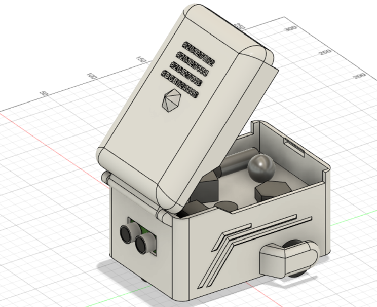
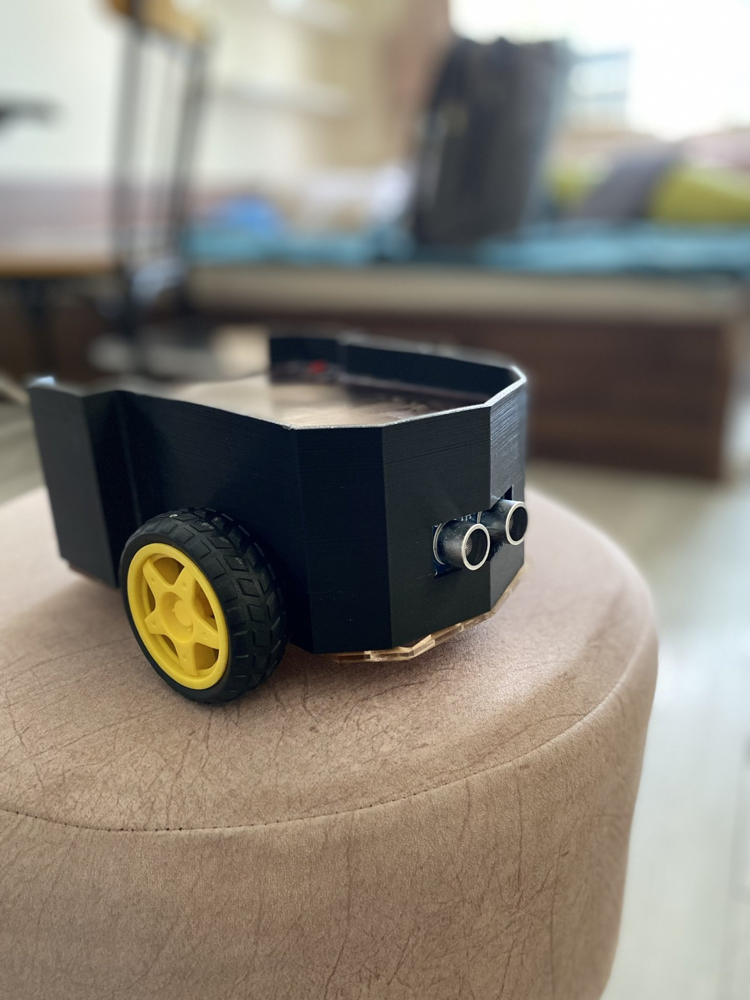
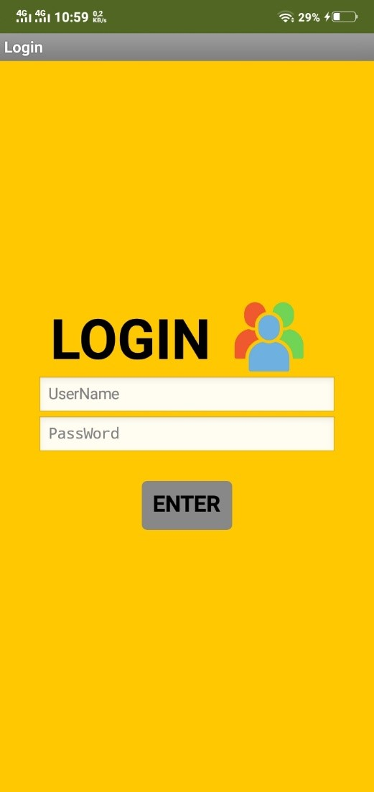
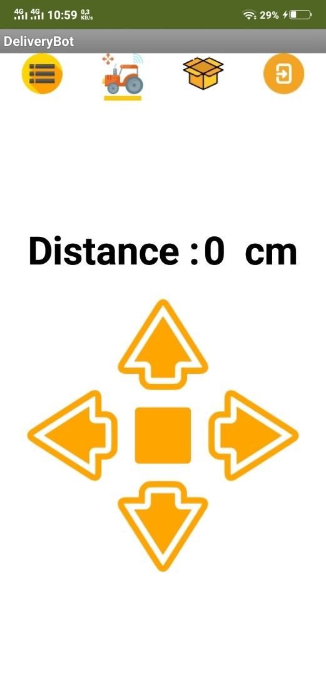
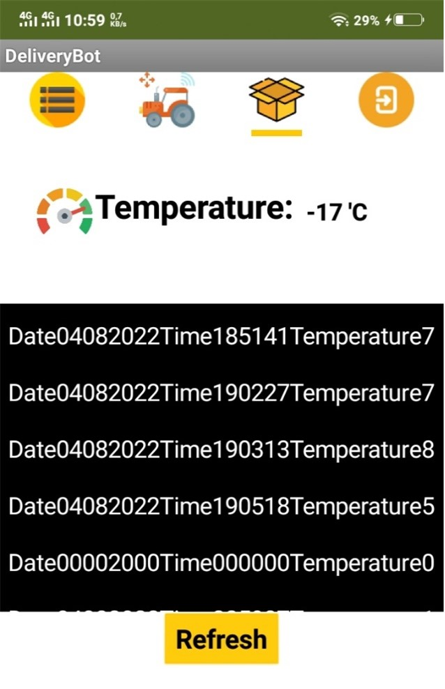

# 🦾 INTERNET OF THINGS
Cargo truck controlled via mobile app

- [App inventor](https://appinventor.mit.edu/), cloud firebase to store data.

- Vehicles transport goods in line, identify the location of the path through information on the cloud and report the location of obstacles, abnormal temperature and humidity on the way to the cloud

- When starting to transport, the vehicle will send an ID signal of the goods being transported to the station, when it is close to the station, it will notify again through the cloud and emit a beep when it arrives and send a notification to the next station. for the previous station

- When we send the id of the goods to be taken into the cart of the cart, the car will automatically move to the stations where the products have the same id with the id in the cart and the staff will put the goods in the cart and then the cart continue to move to other stations to be able to receive goods.

## 🍀 Member

- Hoàng Hữu Minh An - 20127102
- Bùi Duy Bảo - 20127444
- Nguyễn Thái Bảo - 20127448

## 🔌 List of devices

- ESP 8266
- DC L298
- NTC Thermistor
- TCRT5000 Line Follower Sensor 
- Buzzer 5VDC

## 👀 Image car 3D

## Product

## 🛠️ How to work

- Users control the car through the app on the mobile device, when encountering an obstacle, the vehicle will notify the user through the iftt app or in an emergency, it will notify via email.
- When the user presses the navigation button, the app will receive the information and send it directly to the cloud firebase, then esp will get the data directly from the cloud and control the engine.
- The temperature and distance sensors when receiving the signal will send back to the cloud then through the cloud will show to the user or send via notification

## 🕹️ App Control

## 📽️ Link Demo [HERE](https://www.youtube.com/watch?v=0DgIqhF2sC4&t=10s)
